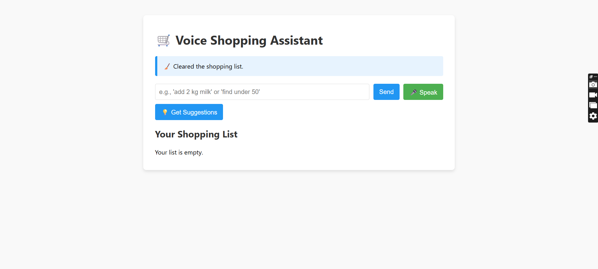

# 🛒 Voice-Enabled Shopping Assistant


This is a smart, voice-controlled shopping list application built to fulfill the requirements of a software engineering technical assessment. It features a web-based UI and a robust Python backend that understands natural language commands in both English and Hindi, demonstrating a full-stack approach from complex NLP processing to a functional web interface.

---

### 🌐 Live Demo & Screenshot

**Live Application URL**: [Live link](https://voice-shopping-assistant-app.onrender.com/) 

---

### ✨ Features Overview

| Feature                  | Description                                                                                             | Status          |
| ------------------------ | ------------------------------------------------------------------------------------------------------- | --------------- |
| **Web Interface** | A clean, minimalist UI built with Flask for managing the shopping list.                                   | ✅ Implemented |
| **Bilingual Voice Commands** | Integrated browser-based voice recognition to process spoken commands in both English and Hindi.          | ✅ Implemented |
| **NLP Pipeline** | Understands natural language, corrects typos, and handles synonyms & plurals.                             | ✅ Implemented |
| **Smart Suggestions** | Recommends items based on shopping history, season, and suggests substitutes.                           | ✅ Implemented |
| **Full List Management** | Supports add, remove, find, and clear. Items are automatically categorized and case-insensitive.          | ✅ Implemented |
| **Price Search** | Allows searching for items under a specific price based on a mock price list.                           | ✅ Implemented |
| **Data Persistence** | Automatically saves and loads the shopping list and history to a JSON file.                             | ✅ Implemented |
| **Export Functionality** | The final list can be exported to both CSV and PDF formats.                                             | ✅ Implemented |

---

### ⚙️ Setup and Running Locally

To run this application on your local machine, please follow these steps.

#### **Prerequisites**
* Python 3.9+
* `ffmpeg`: A system dependency for audio conversion.
    * **On Debian/Ubuntu**: `sudo apt-get install ffmpeg`
    * **On macOS (with Homebrew)**: `brew install ffmpeg`
    * **On Windows**: Download from [gyan.dev](https://www.gyan.dev/ffmpeg/builds/) and add the `bin` folder to your system's PATH.

#### **Installation**

1.  **Clone the Repository**
    ```bash
    git clone [https://github.com/adity0208/Voice-Command-Shopping-Assistant.git](https://github.com/adity0208/Voice-Command-Shopping-Assistant.git)
    cd Voice-Command-Shopping-Assistant
    ```

2.  **Create and Activate a Virtual Environment**
    ```bash
    # For macOS/Linux
    python3 -m venv venv
    source venv/bin/activate

    # For Windows
    python -m venv venv
    .\venv\Scripts\activate
    ```

3.  **Install Python Dependencies**
    ```bash
    pip install -r requirements.txt
    ```

4.  **Run the Application**
    ```bash
    # For a production-like server
    gunicorn --bind 0.0.0.0:8080 app:app
    ```

5.  Open your browser and navigate to `http://127.0.0.1:8080`.

---

### 📝 Project Write-up (Technical Approach Summary)

This project was developed in Python, with the core logic encapsulated in an object-oriented `ShoppingAssistant` class to ensure the code is modular and maintainable.

The heart of the application is a multi-stage NLP pipeline that processes raw user commands. Instead of relying on rigid inputs, the pipeline first identifies the user's intent (e.g., "add," "find") from natural phrases. It then isolates the item details and enriches them by correcting spelling errors with `rapidfuzz`, normalizing synonyms, and converting plurals to a singular, canonical form using the `inflect` library. This robust data handling prevents duplicates and ensures data consistency.

The backend is powered by a lightweight Flask server, which provides a simple web UI and API endpoints for handling commands. Voice recognition is implemented in the browser using the `MediaRecorder` API; the captured audio is sent to a server endpoint, converted from WebM to WAV format in-memory using `ffmpeg`, and then transcribed via the `SpeechRecognition` library. All application data, including the user's list and shopping history, is persisted to a local JSON file, demonstrating a complete, full-stack application loop.
